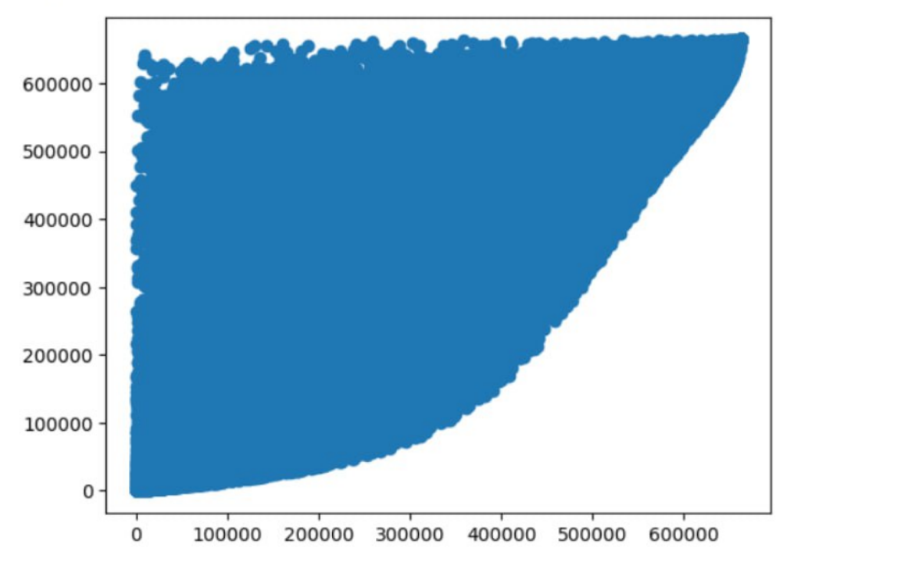
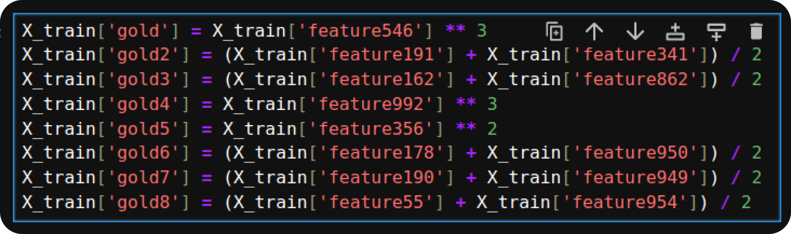
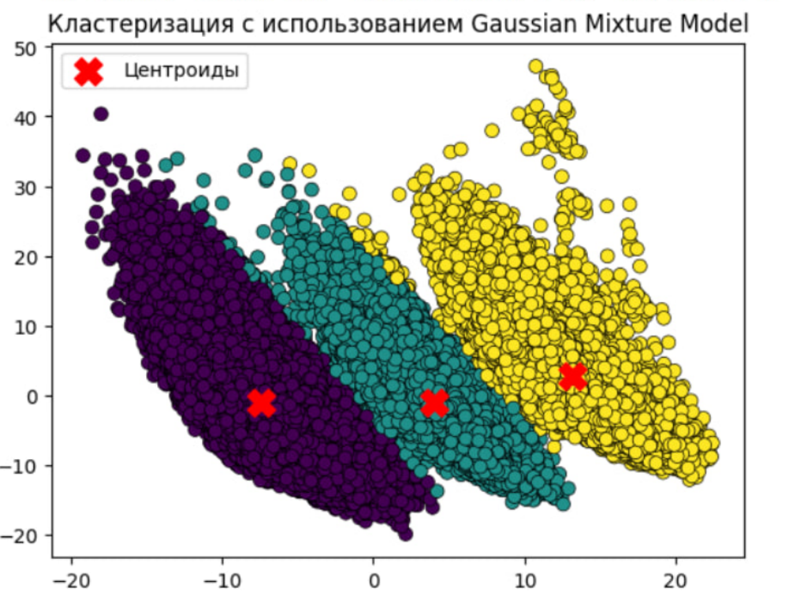

# HSE PCB Hack
#### Кейсы крупнейших IT компаний России, связанные с созданием цифровых продуктов и оптимизацией бизнес-процессов
### Задача
Среди множества кейсов мы выбрали кейс:  
**Прогнозирование оттока зарплатного клиента ФЛ**   
Краткое описание: 
Клиент получает зарплату на карту банка A. Пока клиент получает зарплату в банке, он считается зарплатным клиентом банка A. В какой-то момент Х он перестает получать зарплату на карту банка A (событие оттока). Необходимо до возникновения события оттока спрогнозировать его, используя данные поведения клиента: транзакции, продукты, мобильное приложение, терминалы, прочее.

Результат
ROC-AUC: **0.767**  
F1: **0.12**   

### Данные
Для нас организаторы подготовили датасет на ~400к сэмплов на ~1000 признаков. Фичи, конечно же, анонимизированы. Нам предстояла огромная работа над анализом данных. Порядка десятка фичей мы сразу отбросили.

### Решение
#### Корреляция
В процессе решения мы заметили интересные виды корреляции (не только линейные). Мы предположили, что это один признак - результат аггрегации другого, или, например, один из признаков срез за 1 месяц, а другой - за 3 месяца  

  
#### Отбор признаков
Использовали feature_selection из фреймворка CatBoost, смогли отобрать 70 фичей (~7% от всего количества) без потери качества. Далее поставили полный перебор применения арифметических операций между фичами. Это мы обосновали тем, что какие-то пары фичей имеют какого-то зависимость, какие-то фичи нелинейны. В итоге модель показала существенный (относительно лидерборда) прирост качества.  

  
#### Поиск аномалий
Мы также реализовали поиск аномалий с помощью автоэнкодера. Обучили модель на всех данных, на инференсе брали лосс каждого сэмпла и смотрели: если его значение лосса аномально большое (например чем 95 перцентиль), то этот сэмпл считаем аномальным. 
#### Кластеризация
В какой-то момент мы много пробовали применять эмбеддинги из автоэнкодера. К сожалению их использование не показало никакого прироста качества, однако нам получилось разбить эмбеддинги (в пространстве пониженной размерности) на 3 кластера. Кому я ни показывал - удивила это разбиение. Мы не успели должным образом оценить, дала ли нам прирост качества информация о принадлежности к кластеру, однако, по нашему мнению, этому нужно уделить внимание)  

  
#### Итоговая модель
Нашим решением в итоге является блендинг из 4 CatBoost'ов, их ансабль в итоге показал стабильность на приватном лидерборде. Как нам показалось, по итогу без особой потери качества можно оставить лишь одну модель.
